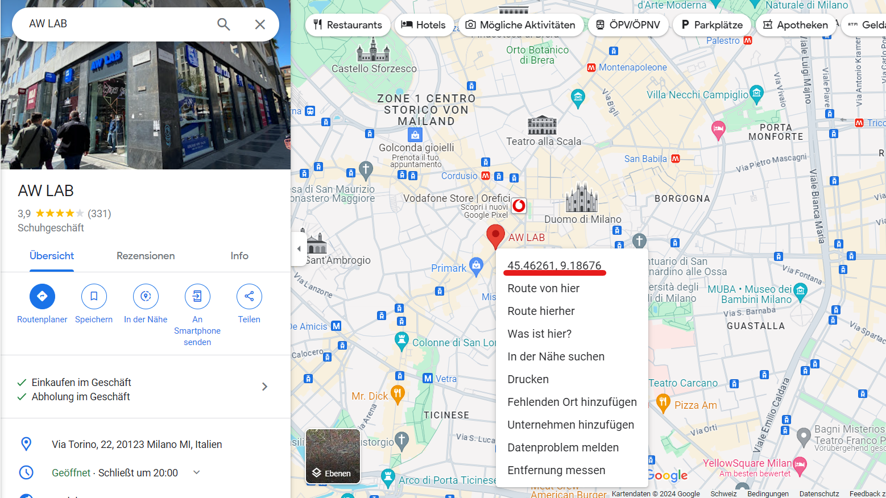

## AwLab In-Store Availability Check

To check in-store availability for Fendi products, use the following endpoint format:
```
https://www.aw-lab.com/on/demandware.store/Sites-awlab-it-Site/it_IT/Stores-FindClickReserve?lat={latitude}&pid={pid}&distancesMap=true&lng={longitude}&color={color}&sizeKey=h05&sizeValue=&format=ajax&mapRadius=100000
```

- `{pid}` is the Product ID.
- `{color}` is the Product Color
- `{latitude}` and `{longitude}` need to be replaced with the coordinates of the store location.

### Obtaining Latitude and Longitude
To find the latitude and longitude of a store, follow these steps on Google Maps:

1. On your computer, open Google Maps.
2. Right-click the place or area on the map. This opens a pop-up window.
3. Find your latitude and longitude in decimal format at the top of the menu.



### Finding the Product ID (PID) & Color

You can get the data from the URL of the product page:
```
https://en.aw-lab.com/women/shoes-AW_100HEOHEOB.html?dwvar_AW__100HEOHEOB_color=5038259
```
The PID here is `AW_100HEOHEOB`.
The Color here is `5038259`.

### Example Link
```
https://www.aw-lab.com/on/demandware.store/Sites-awlab-it-Site/it_IT/Stores-FindClickReserve?lat=41.9028&pid=AW_221CECCEGA&distancesMap=true&lng=12.4964&color=8041540&sizeKey=h05&sizeValue=&format=ajax&mapRadius=100000
```
