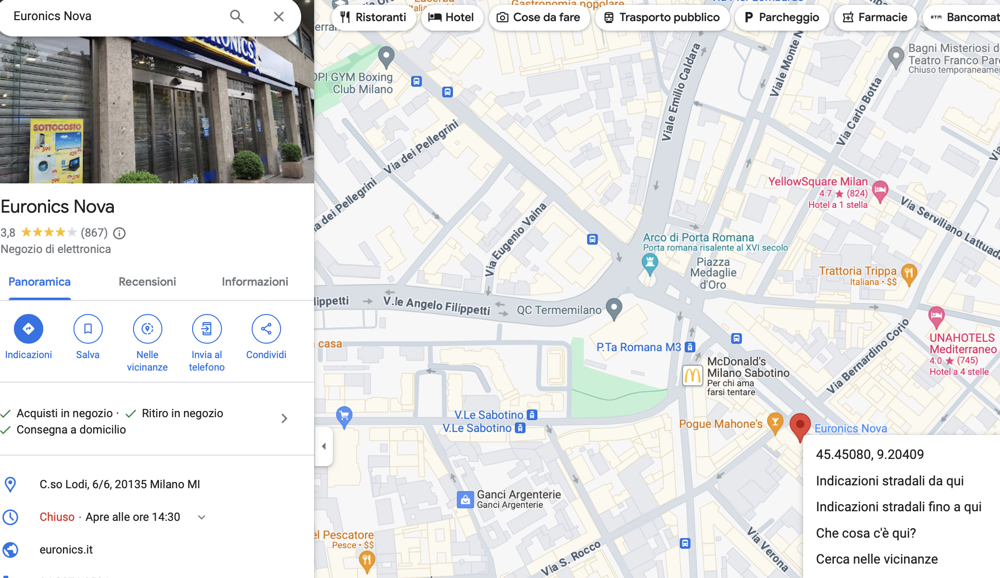

# Euronics In-Store Availability Check

To check in-store availability for Euronics products, use the following endpoint format:
```
https://www.euronics.it/on/demandware.store/Sites-euronics-Site/it_IT/Stores-Inventory?showMap=true&horizontalView=true&isForm=true&pview=tile&availability=yes&lat={latitude}&long={longitude}&pid={pid}&qty=1&isMobile=false&isFromBtn=btn&noSelection=true&radius={radius}&isSocio=false
```

- `{pid}` is the Product ID.
- `{latitude}` and `{longitude}` need to be replaced with the coordinates of the store location.
- `{radius}`can be choosen, is the radius of the area in which the stores are to be located

### Obtaining Latitude and Longitude

To find the latitude and longitude of a store, follow these steps on Google Maps:

1. On your computer, open Google Maps.
2. Right-click the place or area on the map. This opens a pop-up window.
3. Find your latitude and longitude in decimal format at the top of the menu.



### Finding the Product ID (PID)
The Product ID can be obtained this way:

From the URL of the product page, e.g., for the : SONY COMPUTER - PLAYSTATION PORTAL
```
https://www.euronics.it/gaming/playstation-5/accessori-ps5/sony-computer---playstation-portal-eur/232011171.html
```
The PID here is `232011171`.
