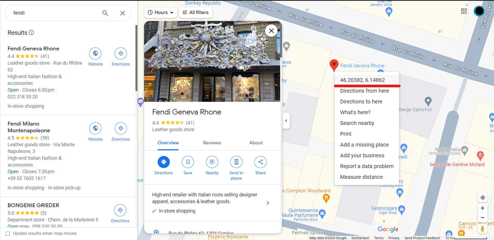

## Fendi In-Store Availability Check

To check in-store availability for Fendi products, use the following endpoint format:
```
https://www.fendi.com/on/demandware.store/Sites-EU1-Site/it_IT/Product-VariationStores?pid={pid}&size=TU&quantity=1&latitude={latitude}&longitude={longitude}
```

- `{pid}` is the Product ID.
- `{latitude}` and `{longitude}` need to be replaced with the coordinates of the store location.

### Obtaining Latitude and Longitude
To find the latitude and longitude of a store, follow these steps on Google Maps:

1. On your computer, open Google Maps.
2. Right-click the place or area on the map. This opens a pop-up window.
3. Find your latitude and longitude in decimal format at the top of the menu.



### Finding the Product ID (PID)
The Product ID can be obtained in two ways:

1. From the URL of the product page, e.g., for the Fendi Match White Suede Low Tops:
```
https://www.fendi.com/gb-en/man/shoes/sneakers/fendi-match-white-suede-low-tops-7e1493ahh2f1fhs
```
The PID here is `7e1493ahh2f1fhs`.

2. On the product page, look under Product Details for the Product Code, e.g., Product Code: 7E1493AHH2F1FHS.

### Example Request
To check the in-store availability of the product `7e1493ahh2f1fhs` at a specific location, replace `{pid}`, `{latitude}`, and `{longitude}` with the appropriate values.
