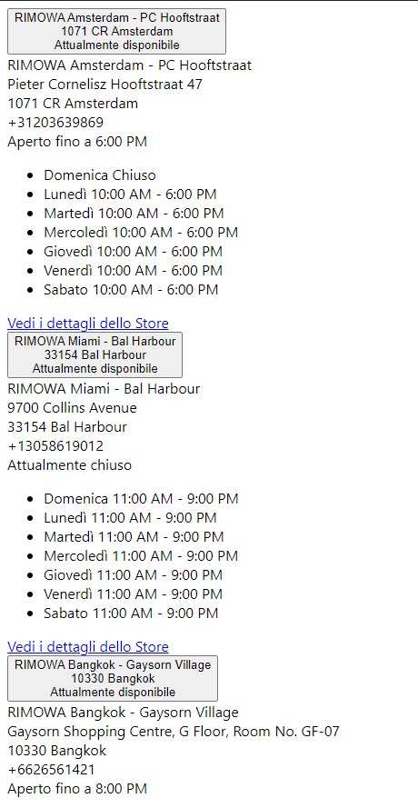

# How to Check In-Store Availability for Rimowa Products

Finding out if a Rimowa product is available in a store near you is straightforward using the Rimowa API. This guide explains how to check the in-store availability of a specific product by utilizing a dedicated API endpoint.

## Step 1: Locate the Product ID (PID)

Before you can check the product's in-store availability, you need to find its Product ID (PID). This ID can usually be found in the product's URL on the Rimowa website. For example:

For the URL `https://www.rimowa.com/ch/de/luggage/colour/blue/check-in-l/83273691.html`, the PID is `83273691`.

## Step 2: Access the API Endpoint

With the Product ID, you can now query the in-store availability. Use the following API endpoint:

```
https://www.rimowa.com/on/demandware.store/Sites-Rimowa-Site/it_IT/StoreLocator-InStoreAvailability?pid={PID}
```

Replace `{PID}` with the actual Product ID you found earlier. This will fetch the availability of that specific product in various stores.

## Understanding the API Response

When you access the API endpoint, the response will be visual rather than textual. You will receive an image detailing the availability of the product in various Rimowa stores. This image provides a visual representation of the product availability, including store names, locations, and the opening hours of each store.



This image is a simplified representation meant to guide you in understanding how to interpret the actual in-store availability data you will receive.

By using this API, you can easily find out which Rimowa stores have your desired product in stock, allowing you to plan your visit or contact the store directly for more information.